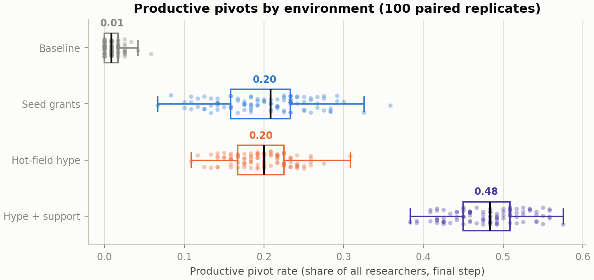
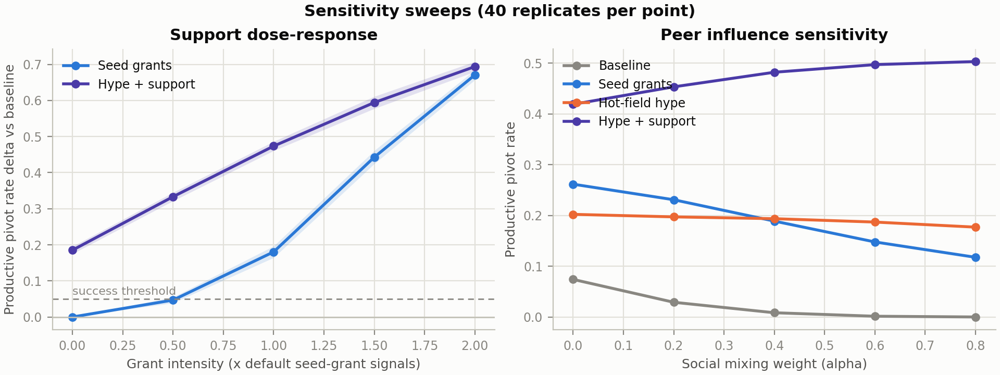
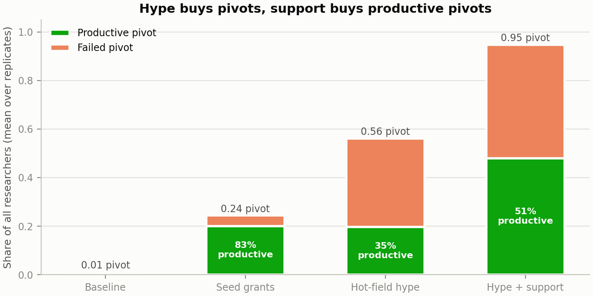
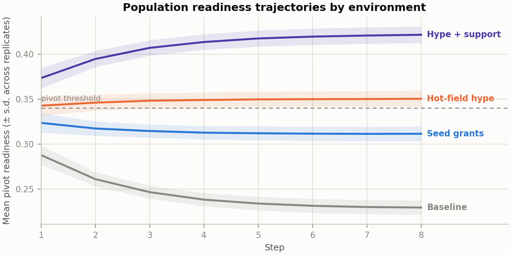
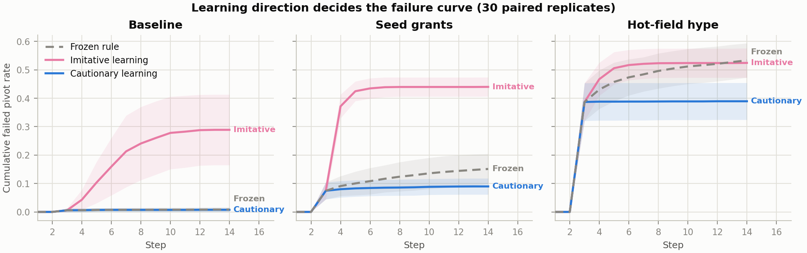
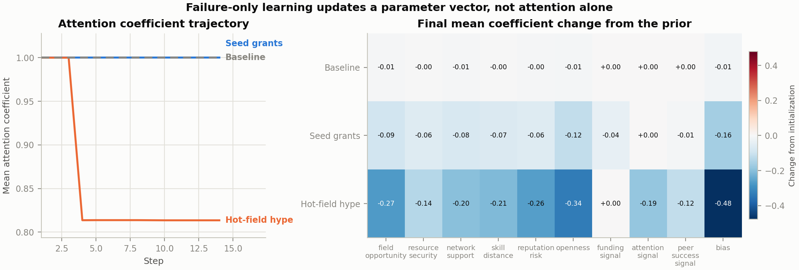

# When Do Researcher Pivots Become Productive?

A two-study replicated case study of field-pivot decisions under different
scientific environments. Study 1 (torch-free `neural_abm.api_lite`) compares
environments under a fixed decision rule. Study 2 (torch-backed
`neural_abm.api`) replaces a static-rule configuration with learning agents
and examines endogenous coefficient updates. This note is the reference end-to-end
research example for the package: research question, stylized mechanism,
component-keyed paired replication, sensitivity sweeps, figures, and limitations.

**Status**: stylized-mechanism study. Parameters are hand-set rather than
calibrated to empirical data. Read the [Limitations](#7-limitations) before
citing any number outside this repository.

## TL;DR

**Study 1** (fixed decision rule, 100 seed-paired replicates of a
120-researcher population):

1. **Seed grants and hype produce similar mean productive gains in this run,
   at very different disruption cost.** Interdisciplinary seed grants raise
   the productive pivot rate by +0.191 [95% mean CI 0.181, 0.202] over
   baseline; hot-field hype raises it by +0.187 [0.180, 0.194]. The direct
   paired hype-minus-grant contrast is −0.004 [−0.012, 0.004], without a
   pre-specified equivalence margin. Hype does this by producing 2.3x as many
   pivots (56% vs 24%) and 8.6x as many failures (36% vs 4% of the population).
2. **Hype changes aggregate pivot composition, not just how many pivot.** Only
   35% of hype-driven pivots are productive versus 83% under seed grants. By
   construction, hype signals are weighted toward resource-insecure and open
   researchers, but the shipped artifact does not retain subgroup composition
   across all replicates; it therefore does not establish which subgroup drove
   this aggregate result.
3. **Peer influence is a double-edged amplifier.** Stronger social mixing
   suppresses both spontaneous pivots and the seed-grant outcome (productive
   rate 0.26 → 0.12 as social alpha goes 0 → 0.8) while consolidating
   hype-driven mass pivoting. This is a sensitivity result of the specified
   network dynamics, not a general conformity theorem.

**Study 2** (learning agents, 30 seed-paired replicates, three arms):

4. **Imitative outcome learning creates a self-reinforcing loop in baseline
   and grant environments, but not in the already-high-pivot hype arm.** Relative to
   the frozen arm, failed pivots rise by +0.281 [95% mean CI 0.235, 0.322] at
   baseline and +0.289 [0.268, 0.308] under grants; the hype difference is
   −0.009 [−0.024, 0.007]. This is not a canonical informational-cascade test.
5. **Failure-only learning reduces hype failures, with broader trade-offs.**
   Failed pivots fall by −0.144 [−0.159, −0.129] under hype, while productive
   pivots also fall by −0.050 [−0.056, −0.044]. The attention coefficient
   moves from 1.00 to 0.81, but the full parameter audit shows simultaneous
   movement in other weights and the bias; attention is therefore an audited
   correlate, not an identified single mechanism.



## 1. Research Question

Should research institutions that want more interdisciplinary mobility
invest in structural support (small grants, bridge ties, reduced reputation
penalties), or is visible hot-field attention enough? Concretely: **under
which environments do researcher pivots become productive rather than merely
frequent?**

Hypotheses:

- **H1 (support)**: seed grants raise the productive pivot rate over
  baseline by more than 5 percentage points.
- **H2 (hype paradox)**: hype raises the pivot rate, but the productive
  share of pivots drops, because attention reaches the desire to pivot
  more strongly than it changes the modeled capacity to pivot well.
- **H3 (interaction)**: support layered on hype recovers part of the
  productive share lost to hype.

## 2. Model

The model is a bounded-scalar Neural-ABM workflow: each step applies a local
adaptation to every researcher's `pivot_readiness`, mixes readiness through
typed peer exchange on a stage-assortative network, and commits the mixed
value through a domain-owned threshold transition. All dynamics run through
`neural_abm.api_lite`; the domain meaning lives in the study script.

### Agents

Each replicate samples 120 researchers. Career stages are drawn with
probabilities early 0.35, mid 0.30, senior 0.20, bridge 0.15, and structural
attributes (`skill_distance`, `resource_security`, `network_support`,
`reputation_risk`, `openness`) come from stage-conditioned Beta
distributions (see `STAGE_ATTRIBUTES` in the study script).

### Push-pull decision structure

The desire to pivot and the capacity to pivot well are deliberately
separated, following the push-pull framing from migration theory applied to
topic mobility as a conceptual analogy, not a validated measurement model:

- **Pivot pressure** (push): field opportunity, openness, resource
  *insecurity*, funding and attention signals, minus skill distance and
  reputation risk.
- **Productive fit** (pull/capacity): field opportunity, network support,
  resource security, minus skill distance and reputation risk. Attention
  itself does not enter fit, while other hype-scenario inputs do.

Hype susceptibility is heterogeneous: attention and peer-success signals are
scaled per researcher by `0.6 * (1 - resource_security) + 0.4 * openness`.
The hype scenario also changes field opportunity, resource security, and
reputation risk. Without a component ablation, the resulting composition
cannot be attributed to susceptibility alone.

### Scenarios

| Scenario | Mechanism | Key signals |
|---|---|---|
| `baseline` | No intervention | — |
| `interdisciplinary_seed_grants` | Program-level support raises pressure *and* fit | funding 0.25, resources +0.10, bridge ties +0.10 and extra network links, reputation −0.05 |
| `hot_field_hype` | Attention and peer-success pressure dominate smaller structural changes | attention 0.55, peer-success 0.35, field +0.06, resources −0.05, reputation risk +0.10 |
| `hype_with_support` | Both signal families at once | sum of the two rows above |

### Transition

A researcher pivots when committed readiness ≥ 0.34 and the pivot is
productive when their structural fit ≥ 0.40. Outcomes are population rates
at the final step.

## 3. Experimental Design

- **Replication**: 100 replicates per scenario via
  `run_replicated_bounded_scalar_scenarios` with `base_seed=20260715`.
  Replicate *r* uses scenario-independent keyed streams for the sampled
  population, base network, topology intervention, and agent-step noise.
  Scenario deltas are therefore paired without treatment-dependent RNG drift.
- **Intervals**: bracketed intervals in the prose are 95% normal-approximation
  CIs for the paired mean delta. The JSON separately records the central 95%
  empirical interval of replicate-level deltas.
- **Primary outcome**: `productive_pivot_rate`; success criterion: mean
  paired delta > 0.05.
- **Dynamics**: 8 steps, local alpha 0.45 with N(0, 0.02) decision noise,
  social alpha 0.40, output-similarity peer rule with threshold 0.68.
- **Sensitivity**: grant-intensity sweep (0x–2x default signals) and social
  alpha sweep (0.0–0.8), 40 replicates per point.

## 4. Results

### R1 — Support raises the modeled outcome; the true-null arm is invariant

Seed grants raise the productive pivot rate by +0.191 [0.181, 0.202]; every
one of the 100 paired replicates clears the caller-supplied +0.05 threshold.
The dose-response is monotone. At zero grant intensity every intervention
component, including extra bridge ties, is exactly zero; the paired effect is
0.000 [0.000, 0.000]. This is a deterministic null-path check on the scenario
machinery, not external validation of the domain model.



### R2 — Hype buys pivots, support buys a more productive composition

Hype and grants have similar mean productive deltas in this run (+0.187 versus
+0.191), but the direct paired contrast is reported rather than treated as an
equivalence result: −0.004 [−0.012, 0.004]. Hype produces pivots in 56% of the
population (versus 24% under grants) and failures in 36% (versus 4%). The
productive share of pivots is 35% under hype and 83% under grants. These are
model-internal composition differences under the specified scenarios.



### R3 — Support changes the saturated hype composition

Combining both signal families yields the largest productive rate (+0.469
[0.461, 0.478]) and lifts the productive share from 35% to 51% — but the
failed pivot rate stays at 47% of the population, because in this regime
pivoting becomes near-universal (95%). Support scales productivity; it does
not cancel hype's waste. We flag this cell as the model's saturation regime
and interpret it qualitatively only.

### R4 — Peer influence suppresses interventions and consolidates hype

The social alpha sweep is a robustness check. Stronger peer mixing over the
selected local peers (a) reduces baseline productive pivots (0.074 → 0.000),
(b) reduces the seed-grant productive rate (0.262 → 0.118), and (c) raises
the overall hype+support pivot rate toward saturation. These directions are
properties of this graph, peer filter, and threshold combination; they are
not a general result about conformity or population-mean preservation.



The trajectory figure shows the mechanism compactly: mean readiness under
seed grants is *lower* than under hype, yet grants produce equally many and
far better pivots — who crosses the threshold matters more than how much
the population average moves.

## 5. Interpretation

Within the model's assumptions, the policy-relevant readings are:

- Counting pivots overstates hype and understates support. Composition
  metrics (productive share, failed-pivot rate) invert the ranking.
- The modeled hype composition is compatible with heterogeneous
  susceptibility plus weak structural support, but the bundled scenario does
  not identify either component as the unique cause.
- Environments with strong conformity dynamics may need stronger targeted
  support to achieve the same productive mobility.

## 6. Study 2 — Can Learning Agents Self-Correct the Hype Paradox?

Study 1's decision rule is fixed: no researcher ever revises how they weigh
attention against resources, no matter what they observe. Study 2 removes
that assumption. It runs on the torch-backed `neural_abm.api` lifecycle
(`NABMUnit`, typed bounded-scalar channel, domain-owned commit adapter) and
asks: **when researchers learn from observed pivot outcomes, does the hype
paradox self-correct — or does hype outpace learning?**

### Design

Three arms share one sigmoid decision policy over the same nine observable
features; within Study 2, the only arm-level difference is the update rule:

| Arm | Update rule |
|---|---|
| `frozen` | Never updates; a monotone sigmoid reparameterization initialized from the Study 1 coefficients. |
| `imitative` | Vicarious gradient learning from every observed neighbor pivot outcome, excluding the agent's own outcome. |
| `cautionary` | The same neighbor-only update, restricted to observed failures; this is a postulated failure-only rule. |

Pivots are absorbing events with publicly visible outcomes; pivoted
researchers keep broadcasting readiness, so hype contagion and outcome
learning compete on the same stage-assortative network. A weak L2 anchor to
the prior rule models conservative belief updating; a 2-step burn-in keeps
initial-condition transients from being absorbed as pivots. 30 seed-paired
replicates, 14 steps, three scenarios (baseline, seed grants, hype). Population,
base-network, intervention-topology, and agent-step noise streams are keyed by
component so treatment-dependent control flow cannot reassign later shocks.
Study 2's bracketed intervals are deterministic 10,000-resample percentile-
bootstrap CIs for the paired mean delta; its JSON also stores the empirical
replicate interval separately.

The policy class is deliberately minimal (ten named parameters per agent):
each agent's training signal is single-digit observed outcomes, so larger
models would fit noise; named weights make the learned-parameter trajectory
inspectable; and minimal capacity keeps the
fixed-versus-learning comparison free of a capacity confound. The
system-level nonlinearity sits in thresholds, absorbing events, and contagion.
The lifecycle accepts arbitrary torch modules, so this is an escalation ladder,
not a cap. Inspectability does not by itself identify a coefficient as causal.

Because pivots are absorbing (anyone who ever crosses the threshold stays
pivoted), the frozen arm's cumulative rates sit above Study 1's final-step
state rates; comparisons are within-design, against the frozen control.

### R5 — Imitative learning amplifies baseline and grant pivoting

Observed outcomes are selectively observed: only pivoters reveal outcomes,
and early pivoters are the best-positioned, so they mostly succeed. For an
imitative learner this one-sided evidence can raise future pivot propensity.
Failed pivot rates rise by +0.281 [0.235, 0.322] at baseline and +0.289
[0.268, 0.308] under seed grants. Under already-high-pivot hype, the failed-rate
difference is −0.009 [−0.024, 0.007], while productive pivots rise by +0.025
[0.015, 0.034]. We therefore call the first two patterns self-reinforcing
outcome-learning loops, not a textbook informational cascade and not an effect
that appears in every environment.



### R6 — Failure-only learning reduces hype failures, with broad updates

Failure-only learners cut the failed pivot rate under hype by −0.144
[−0.159, −0.129] relative to the frozen rule. Productive pivots also fall by
−0.050 [−0.056, −0.044]. The mean attention coefficient falls from 1.00 to
0.81, but the stored trajectories show concurrent changes in field, resource,
network, skill, reputation, openness, peer-success, and bias parameters. The
attention trace is therefore one visible correlate of a multivariate update,
not an identified single route to "hype immunity."



### R7 — The price of caution

Under seed grants, failure-only learners reduce failures by −0.061
[−0.073, −0.052] but also reduce productive pivots by −0.069
[−0.081, −0.059]. Baseline is not exactly invariant: the productive-pivot
delta is −0.004 [−0.007, −0.001]. The modeled rule trades activity and failures
together; it is not a uniformly beneficial correction.

### Why this needed learning agents

A static-rule configuration of this model cannot represent endogenous
coefficient updates. Study 2 demonstrates that the NABM lifecycle can run
frozen and adaptive variants through the same typed exchange and domain
transition path while preserving paired exogenous shocks and parameter audit
traces. This is a repository expressiveness claim, not a claim that adaptive
agents are unavailable in other ABM frameworks or that learning improves the
policy outcome.

## 7. Limitations

- **Stylized, not calibrated.** All parameters are hand-set constants; no
  empirical bibliometric data was fit. Effect sizes are
  model-internal quantities, not field estimates.
- **Thresholds are modeling choices.** The pivot (0.34) and productivity
  (0.40) thresholds were chosen to make the baseline pivot rate low (~1%);
  that target is not empirically validated. Orderings were checked under the
  reported sweeps, but a
  fuller threshold sensitivity analysis is future work.
- **The hype+support cell saturates** (95% pivot rate), so its magnitudes
  are less meaningful than its ordering.
- **`productive_fit` is static per researcher**; a pivot does not feed back
  into skills or resources, and there is no time-to-recovery dynamic.
- Baseline pivots are near zero, so ratio-style comparisons against baseline
  are unstable; all claims use absolute rate deltas.
- **Study 2's learning modes are assumptions, not discoveries.** Imitative
  and failure-only learning are postulated update rules; the study does not
  estimate which rule people use. The learning rate and prior-anchor strength
  were fixed, not swept, and the policy is linear in the observed features.
- **The frozen arm is not Study 1 verbatim.** It is a monotone sigmoid
  reparameterization initialized from Study 1 coefficients, and Study 2 also
  uses absorbing pivots and a burn-in. Comparisons are within Study 2.
- **Mechanisms are bundled.** Hype changes several inputs, and learning moves
  several parameters. Component ablations are required before attributing an
  outcome to susceptibility or the attention coefficient alone.
- **Study 2 outcomes are immediately and perfectly observable.** Real pivot
  outcomes reveal slowly and noisily; delayed or noisy outcome disclosure
  would weaken learning and is the most interesting extension.

## 8. Reproduction

From a repository clone:

```bash
# Study 1: full study + sweeps (roughly 1-3 minutes, torch-free)
uv run --no-dev python examples/research_pivot_study.py --sweeps \
  --output docs/case-studies/researcher-pivot/data/study_results.json

# Study 2: learning agents (roughly 1-2 minutes, requires torch)
uv run python examples/research_pivot_learning_study.py \
  --output docs/case-studies/researcher-pivot/data/learning_study_results.json

# case-study figures + selected paper/figures copies (requires dev/plot deps)
uv run python scripts/plot_research_pivot_study.py

# fast smokes
uv run --no-dev python examples/research_pivot_study.py --quick
uv run python examples/research_pivot_learning_study.py --quick
```

Determinism: with the recorded source snapshot, configuration, runtime versions,
and `--base-seed` (default 20260715), rerunning deterministically regenerates the
tracked numeric payload. The JSON artifact in `data/` is the run the figures
were rendered from. Each artifact records the full configuration,
package/runtime versions, Git revision and worktree state, a source-snapshot
SHA-256, and the keyed-RNG contract. When the worktree flag is true, the source
snapshot—not the Git revision alone—identifies the generating code.

## 9. Framework Surface Used

Study 1 exercises the researcher-facing torch-free path end to end:

- `ScenarioDefinition`, `BoundedScalarScenarioSpec` — question, scenarios,
  success criterion.
- `ReplicationSpec`, `ScenarioReplicateContext`,
  `run_replicated_bounded_scalar_scenarios` — seed-paired replication with
  outcome distributions and paired comparisons.
- The bounded-scalar workflow underneath contributes typed peer exchange,
  commit reports, and aggregate/micro audit rows. The artifact retains every
  primary replicate outcome plus a labeled three-agent micro sample from the
  first replicate of each scenario; it does not claim to ship every agent row.

Study 2 exercises the stable torch-backed lifecycle:

- `NABMUnit`, `NABMStep`, `SocialBlock`, typed `SocialChannel`
  (bounded-scalar) — the local-update / typed-exchange / commit separation
  with learning agents implementing the NABM agent protocol.
- A domain-owned commit adapter absorbs pivot events and publishes outcomes,
  and `select_bounded_scalar_output_peers` applies the same peer rule as
  Study 1.
- The learning artifact retains raw per-replicate arm outcomes and trajectories,
  the complete config, and mean/dispersion trajectories for all nine weights
  plus the bias. These traces make multivariate updates inspectable without
  turning them into causal identification.
- Known gap surfaced by this study: the seed-paired replication helpers
  currently live in `scenario_lite` only; Study 2 reimplements the replicate
  loop by hand. Generalizing replication over the torch lifecycle is queued
  framework work.

## 10. Conceptual References

- The push-pull language is a conceptual borrowing from Everett S. Lee,
  ["A Theory of Migration" (1966)](https://doi.org/10.2307/2060063); it does
  not calibrate the researcher-pivot variables.
- The canonical definition of an informational cascade comes from
  Bikhchandani, Hirshleifer, and Welch,
  ["A Theory of Fads, Fashion, Custom, and Cultural Change as Informational
  Cascades" (1992)](https://doi.org/10.1086/261849). The gradient-feedback
  loop here does not implement that canonical decision model, so the results
  use the narrower term "self-reinforcing outcome-learning loop."
