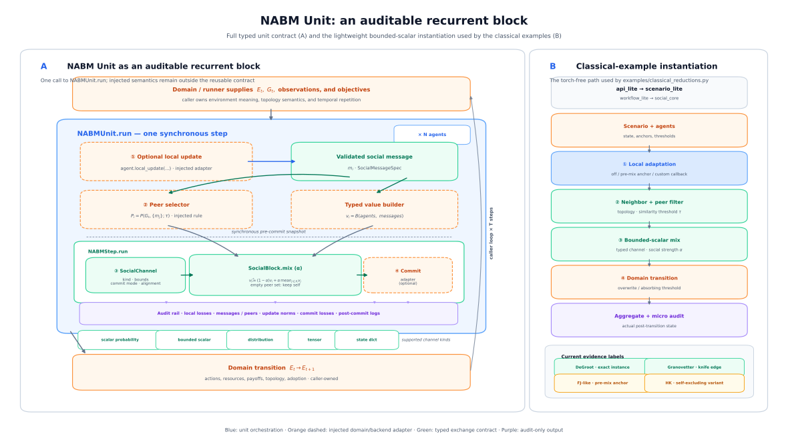

# The Switchboard: Classical Models as Switch Settings

Neural ABM is positioned as the auditable middle between classical rule-based
ABM and fully neural or LLM-agent simulation. That position earns trust in
two directions: with switches turned **off**, the same lifecycle instantiates
classical baselines or explicitly labeled near variants; with switches turned
**on**, it shows dynamics those models cannot express. This document maps the
controls to those model branches and records what the current implementations
actually verify.



**Figure 1. NABM Unit as an auditable recurrent block.** One synchronous step
separates optional local adaptation, validated message construction, peer
selection, typed social mixing, an optional injected commit adapter, and audit
output across `N` agents; the domain then advances the environment and repeats
the block for `T` timesteps. `×N` denotes protocol repetition, not shared
parameters. The right-hand panel shows the torch-free bounded-scalar
instantiation used below. A
[PNG rendering](figures/nabm_unit_recurrent_block.png) is provided for clients
that do not display SVG.

Four explicit controls locate each classical example in the block: the
**local rule**, **peer rule**, **exchange channel and mixing strength**, and
**commit rule**. The examples route these controls through `api_lite` →
`scenario_lite` → `workflow_lite` → `social_core`; they do not imply that the
models form one nested parameter family. In particular, the current anchored
example is an **FJ-like anchored-averaging variant**, and the current
bounded-confidence example is a **self-excluding HK variant**.

Runnable, deterministic regression demonstration:
`examples/classical_reductions.py` (torch-free, about one second), with checks
in `tests/test_classical_reductions.py`.

```bash
uv run --no-dev python examples/classical_reductions.py
```

## Verified Instantiations

All four examples run the same bounded-scalar lifecycle used by the
[researcher-pivot case study](case-studies/researcher-pivot/README.md) —
local adaptation, typed peer exchange, domain-owned commit, audit rows —
with the explicit settings shown below. Initial conditions are `linspace`
grids, so there is no randomness anywhere.

| Model or variant | Control setting | Verified result |
| --- | --- | --- |
| **DeGroot (1974)** iterated averaging | similarity threshold 0, local update off, ring network, alpha 0.5 | Monotone variance decay to consensus at the preserved initial mean (final range < 1e-3, mean exactly 0.5). |
| **FJ-like anchored averaging** (after Friedkin–Johnsen, 1990) | DeGroot plus a pre-mix local anchor toward each agent's initial opinion (weight 0.3) | Stationary state with persistent disagreement (final range 0.65) instead of consensus. Because the anchored state is subsequently mixed, this is not the canonical FJ recurrence. |
| **Self-excluding HK variant** (after Hegselmann–Krause, 2002) | all-to-all network, alpha 1.0, similarity threshold `1 - epsilon`, focal agent excluded from its confidence set | Cluster count falls 8 → 3 → 1 as the confidence bound grows (epsilon 0.05, 0.15, 0.35). This demonstrates bounded-confidence selection, but not the canonical self-inclusive HK update. |
| **Granovetter (1978)** threshold cascade | absorbing threshold transition over the adoption share among the other agents, local update off, all-to-all network, similarity threshold 0, alpha 1.0 | Uniform threshold ladder cascades to 100/100 adopters; moving a single agent's threshold from 1/N to 2/N collapses the cascade to 1 — the classic knife edge, reported by the scenario comparison as delta −99 with the success criterion met. |

The Granovetter row doubles as a demonstration of the scenario machinery:
the knife edge is expressed as a baseline/counterfactual pair and detected
by the same comparison report used in the research studies.

Related in-repo evidence at the game-theoretic end: the Toy 2 experiments
compare neural policies against **Fermi-rule** and **replicator-dynamics**
baselines (see `paper/claim-matrix.md`), so classical imitation dynamics are
covered as maintained baselines rather than reductions.

## The Switchboard

| Mechanism or configuration | Classical or fixed-rule branch | Extension opened by the lifecycle |
| --- | --- | --- |
| Learning disabled (`learning_rate = 0` where a learner is present) | The fixed-rule examples above; the frozen arm of Study 2 uses this setting | Endogenous rule change: imitation cascades, acquired hype immunity ([case study](case-studies/researcher-pivot/README.md) Study 2) |
| Social mixing (`social_alpha = 0`) | Independent decision-makers (no social channel) | The double-edged conformity result (Study 1: interventions suppressed, bandwagons consolidated) |
| Peer similarity threshold `= 0` | A DeGroot instance when combined with a fixed stochastic network, fixed alpha, and overwrite transition | — |
| Peer similarity threshold `> 0`, excluding self | Self-excluding HK variant | Bounded confidence interacting with learning (unexplored: how homophily biases the learning signal) |
| Pre-mix self anchor (`anchor_weight > 0` toward the initial opinion) | FJ-like anchored averaging | The prior-anchored conservative belief updating of Study 2 uses a separate mechanism and parameterization |
| Absorbing threshold transition (commit adapter) | Verified Granovetter knife edge; with graph-local exposure and similarity filtering disabled, the lifecycle can express a Watts-type cascade, but that branch is not verified here | Cascades *competing with* learning: contagion speed versus learning speed |
| State-dict channel + `StateDictLoadAdapter` | Selected-peer, equal-weight parameter gossip/model averaging; this is not the sample-weighted server protocol of full FedAvg | Opinion dynamics on model parameters: knowledge diffusion as weight diffusion |
| Distillation commit adapters | Peer/ensemble soft-target distillation; a single peer with full social weight gives a narrow teacher–student special case | How teaching influence is distributed across a selected peer set and topology |

## The Branching Narrative

Read as branches rather than a mathematical nesting, the switchboard places
fifty years of social dynamics on one auditable lifecycle: DeGroot uses fixed
averaging; the HK-like branch changes peer selection; the FJ-like branch adds a
pre-mix anchor; and Granovetter changes the state and commit rule to absorbing
threshold adoption. Learning is an orthogonal overlay. The researcher-pivot
Study 2 is this repository's first controlled demonstration of what that
overlay changes: whether the fixed-rule dynamics persist depends on the
*direction* of learning, not merely its presence.

## Scope Notes

- The anchored-averaging variant applies the anchor before social mixing, so
  its recurrence is `W[(1-a)x_t + a x_0]`, not the canonical FJ recurrence
  `(1-a)W x_t + a x_0`.
- The bounded-confidence variant mixes to the mean of similar peers while
  excluding self. This can change trajectories qualitatively, including the
  two-agent case, and is therefore not only a small boundary convention.
- These deterministic examples validate the *lifecycle and exchange
  machinery*. They are regression demonstrations, not proofs of formal
  equivalence or claims that the framework's defaults correspond to a
  particular classical model.
- The state-dict and distillation rows are mechanism correspondences, not
  additional verified classical reductions. Exact FedAvg would additionally
  require a server round and client-data weighting; a canonical distillation
  protocol would need its teacher, temperature, and loss contract specified.
